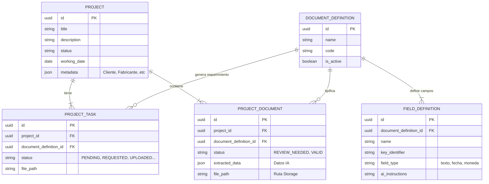
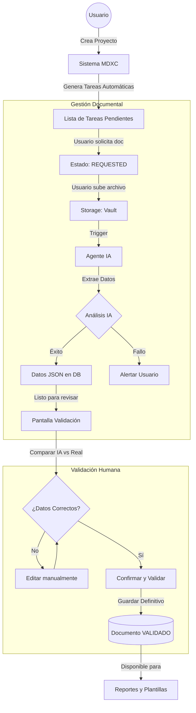

# Documentación del Sistema MDXC

## 1. Diagrama de Entidad-Relación (Base de Datos)

Este diagrama muestra cómo se estructuran y relacionan los datos principales del sistema.

---

## 2. Flujo de Trabajo del Usuario (User Flow)

Este diagrama ilustra el ciclo de vida de un documento dentro del sistema, desde la creación del proyecto hasta la validación final.

